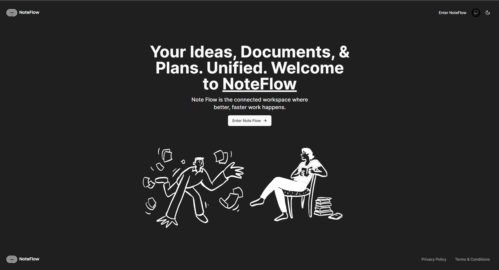
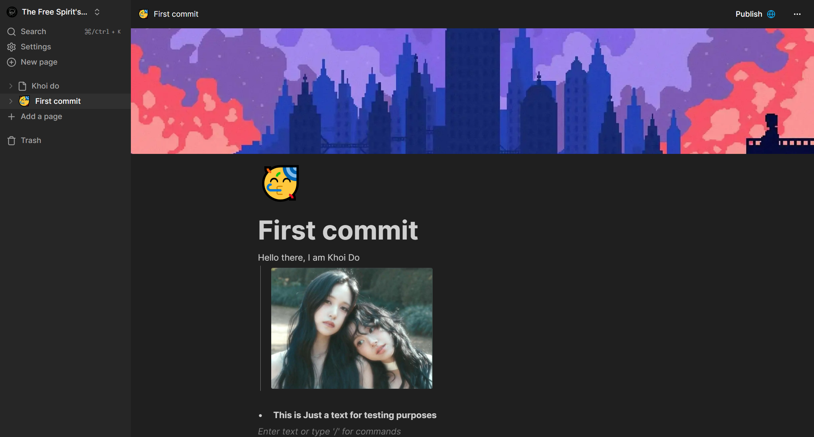
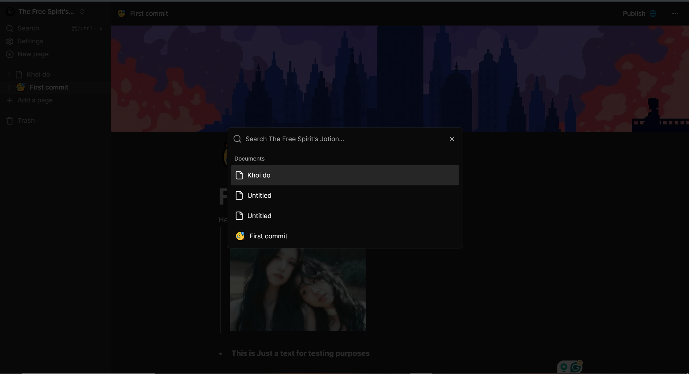

<p align="center">
  
</p>

# Note Flow

NoteFlow is a powerful productivity and collaboration platform designed to elevate the way you organize, collaborate, and innovate. With a user-friendly interface and robust features, NoteFlow empowers individuals and teams to effortlessly capture, refine, and share their thoughts, notes, and tasks.

## Features

- **Note Management:** Create, edit, and organize your notes effortlessly.
- **Task Tracking:** Keep track of your tasks with customizable lists and boards.
- **Document Handling:** Store and manage documents securely.
- **Collaboration:** Share notes and documents with others.
- **Authentication:** Secure user authentication powered by Clerk.
- **Customization:** Tailwind CSS enables easy customization of the user interface.

## Screenshots


_Homepage._


_Edit your document_


_Find document_

## Technologies Used

- [Next.js](https://nextjs.org/)
- [Tailwind CSS](https://tailwindcss.com/)
- [TypeScript](https://www.typescriptlang.org/)
- [Convex](https://convex.netlify.app/)
- [Clerk](https://clerk.dev/)
- [Blocknote](https://blocknote.app/)
- [Zudstand](https://zudstand.com/)
- [Edgestore](https://edgestore.io/)

## Getting Started

1. **Clone the repository:**

   ```bash
   git clone https://github.com/khoido2003/NoteFlow.git
   cd NoteFlow
   ```

2. **Install dependencies:**

   ```bash
   npm install
   ```

3. **Set up your environment variables:**

Create a `.env.local` file in the root directory and add the following:

```env
CONVEX_DEPLOYMENT=''
NEXT_PUBLIC_CONVEX_URL=''
NEXT_PUBLIC_CLERK_PUBLISHABLE_KEY=''
EDGE_STORE_ACCESS_KEY=''
EDGE_STORE_SECRET_KEY=''
```

4. **Run Convex database migrations:**

   ```bash
   npx convex dev
   ```

5. **Start the development server:**

```bash
npm run dev
# or
yarn dev
# or
pnpm dev
# or
bun dev
```

Open [http://localhost:3000](http://localhost:3000) with your browser to see the result.

You can start editing the page by modifying `app/page.tsx`. The page auto-updates as you edit the file.

This project uses [`next/font`](https://nextjs.org/docs/basic-features/font-optimization) to automatically optimize and load Inter, a custom Google Font.

## Learn More

To learn more about Next.js, take a look at the following resources:

- [Next.js Documentation](https://nextjs.org/docs) - learn about Next.js features and API.
- [Learn Next.js](https://nextjs.org/learn) - an interactive Next.js tutorial.

You can check out [the Next.js GitHub repository](https://github.com/vercel/next.js/) - your feedback and contributions are welcome!

## Deploy on Vercel

The easiest way to deploy your Next.js app is to use the [Vercel Platform](https://vercel.com/new?utm_medium=default-template&filter=next.js&utm_source=create-next-app&utm_campaign=create-next-app-readme) from the creators of Next.js.

Check out our [Next.js deployment documentation](https://nextjs.org/docs/deployment) for more details.
